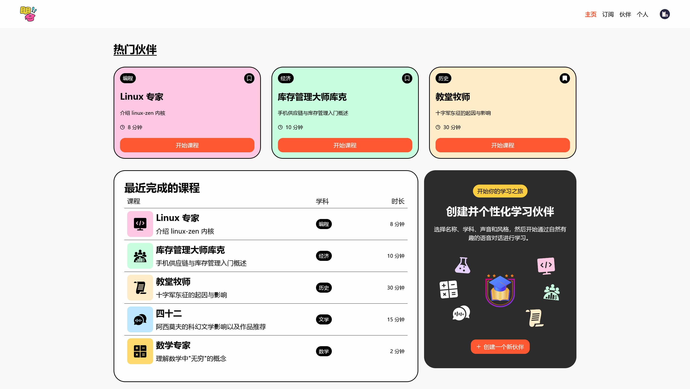
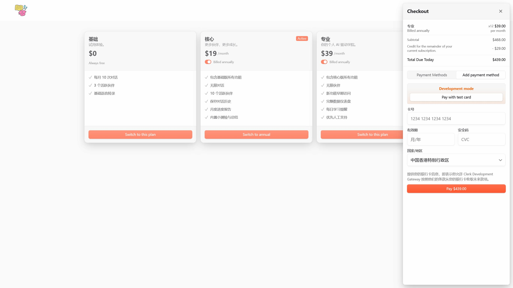
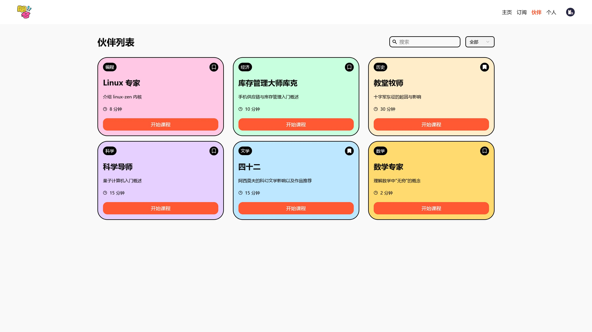
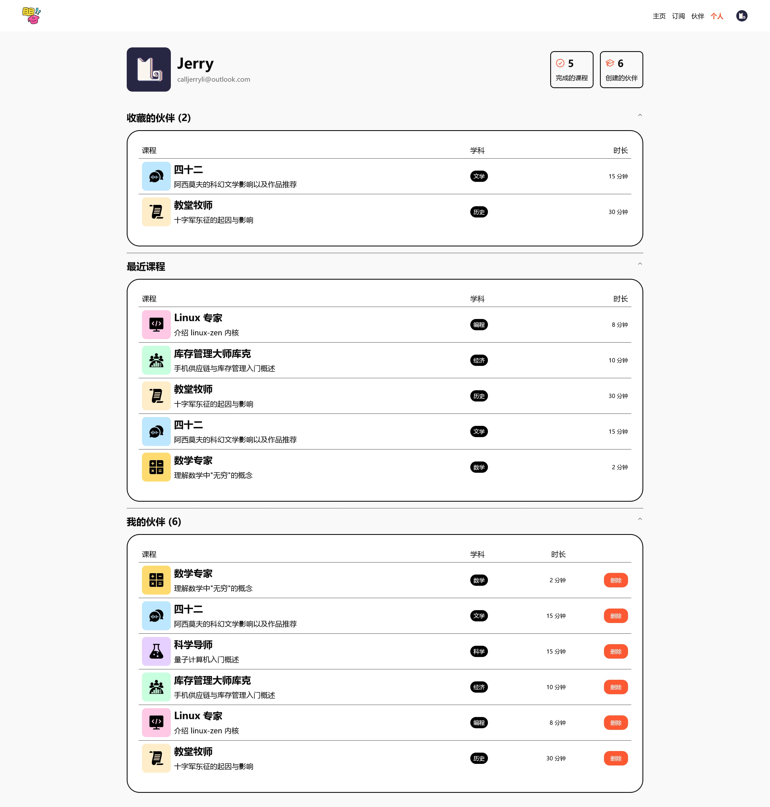
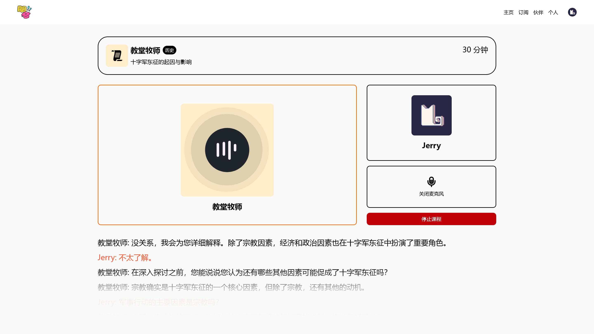

# Hanasu - 使用对话学习任何主题

_Hanasu_ 是一个语音驱动的 AI 学习平台。在指定一个主题后，学习伙伴将会使用实际的对话讲解知识，用户可以随时使用麦克风直接提问，提供流畅且互动的学习体验，而不仅仅是照本宣科地读课本。

## 功能特性

| 功能特性            | 用户价值                                           |
| ------------------- | -------------------------------------------------- |
| **AI Voice Agents** | AI 与用户一起语音讨论专门指定的主题                |
| **身份验证**        | 使用 GitHub、Google OAuth 等安全的用户注册和登录   |
| **计费和订阅**      | 轻松管理订阅和付款详情                             |
| **书签和历史**      | 让用户通过将伙伴加入书签和访问以前的课程来组织学习 |
| **创建伙伴**        | 创建自己的 AI 伙伴，自由选择主题和对话风格         |
| **跨设备兼容性**    | 现代响应式设计，可在所有设备上无缝运行             |
| **搜索功能**        | 使用筛选器和搜索栏快速查找                         |

## 在线体验

https://hanasu-nine.vercel.app

_Demo 实例受成本限制，目前无法稳定提供服务。如果这个项目对你有价值，欢迎[为我充电](https://space.bilibili.com/281356255)！_

## 技术栈

- Next.js
- Tailwind CSS
- TypeScript
- Supabase
- Clerk
- Vapi

## 快速开始

按照以下步骤在本地机器上设置项目：

### 克隆代码仓库

```bash
git clone https://github.com/jerryshell/hanasu.git
cd hanasu
```

### 安装项目依赖

```bash
npm install
```

### 设置环境变量

在项目根目录下创建一个 `.env.local` 文件，并添加以下内容：

```env
# Clerk
NEXT_PUBLIC_CLERK_PUBLISHABLE_KEY=
CLERK_SECRET_KEY=

# Clerk - Custom Auth
NEXT_PUBLIC_CLERK_SIGN_IN_URL=/sign-in
NEXT_PUBLIC_CLERK_SIGN_IN_FALLBACK_REDIRECT_URL=/
NEXT_PUBLIC_CLERK_SIGN_UP_FALLBACK_REDIRECT_URL=/

# Supabase
NEXT_PUBLIC_SUPABASE_URL=
NEXT_PUBLIC_SUPABASE_ANON_KEY=

# Vapi
NEXT_PUBLIC_VAPI_PUBLIC_KEY=
```

将值替换为实际的 Clerk、Supabase、Vapi 凭证。

Supabase 迁移数据在 [supabase](supabase) 目录中，请配合 Supabase CLI 使用。

### 运行项目

```bash
npm run dev
```

在浏览器中打开 http://localhost:3000 查看项目。

## 项目截图

<div align="center">
  
  <p><em>主页</em></p>

  
  <p><em>订阅</em></p>

  
  <p><em>伙伴列表</em></p>

  
  <p><em>个人资料</em></p>

  
  <p><em>语音互动 + 文字转录</em></p>
</div>

## 开源协议

[GNU Affero General Public License v3.0](LICENSE)
